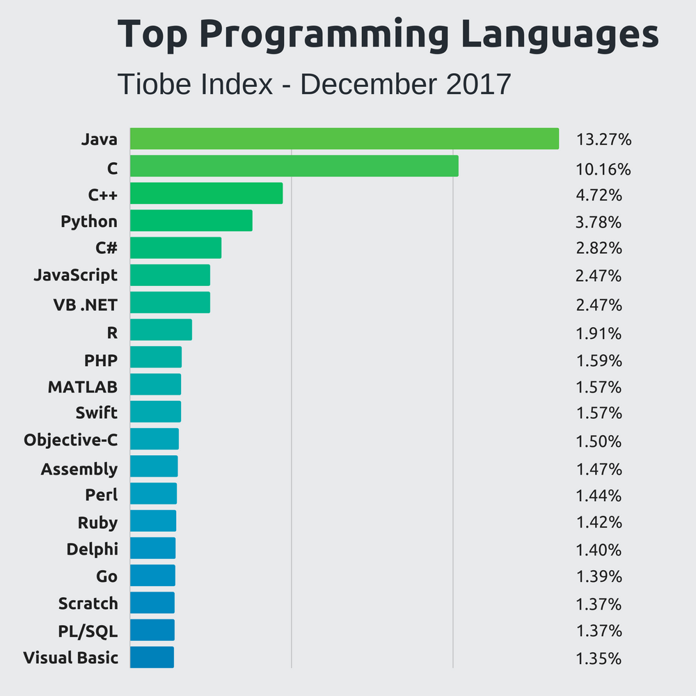

Now that I've finally got my [personal site](www.bedfordwest.com) up and running, I've been thinking a lot about what to work on next.
This is a more difficult problem to solve than it might seem, as there are multiple competing interests and needs. On one hand, I typically
most enjoy working on hobby game projects. This provides a lot of room for creativity, while also allowing me to experiment with new
development technologies or techniques. On the other hand, I sometimes feel like those projects aren't teaching me as much as I could learn
with some other, more specialized project. In addition, I often think I could better boost my portfolio with a more diverse project, as well.

In addition to the question about *what* to work on next, there's also the question of which language and tools to use, as well. For this, I've been doing some research on the current popularity of various languages, and have found [this Stackify](https://stackify.com/popular-programming-languages-2018/) article by Ben Putano handy for consolidating some of the recent popularity measures. These three charts are particularly helpful:

For me, I have the following considerations:
* I'm already pretty competant with Java due to my experience with LibGdx and Selenium/Cucumber-JVM at work.
* I've recently been working with JavaScript/React for my personal site and some work side projects, but still at a basic competancy.
* I've worked with Python some at my last job, but never really got in depth with it or especially comfortable.
* I worked with C and C++ in the past for learning, school, and hobby game dev projects, but it's been probably 10 years since I've touched either with any depth.
* I really, really have enjoyed my recent experience with Rust and learning functional programming techniques, but my knowledge of these is also still basic.

Considering the above, if I want to focus on career it would seem that either continuing with JavaScript, working on a C or C++ project, or perhaps reapproaching Python would be the best idea. For personal enjoyment, I really like the idea of getting back to Rust.

So, what to do? I'll update here once I've figured something out...
